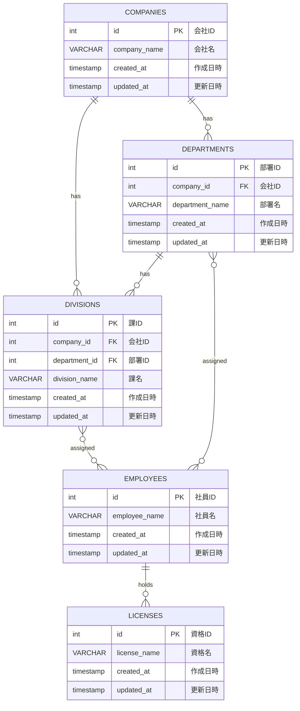

```mermaid
erDiagram
    COMPANIES {
        int id PK "会社ID"
        VARCHAR company_name "会社名"
        timestamp created_at "作成日時"
        timestamp updated_at "更新日時"
    }

    DEPARTMENTS {
        int id PK "部署ID"
        int company_id FK "会社ID"
        VARCHAR department_name "部署名"
        timestamp created_at "作成日時"
        timestamp updated_at "更新日時"
    }

    DIVISIONS {
        int id PK "課ID"
        int company_id FK "会社ID"
        int department_id FK "部署ID"
        VARCHAR division_name "課名"
        timestamp created_at "作成日時"
        timestamp updated_at "更新日時"
    }

    LICENSES {
        int id PK "資格ID"
        VARCHAR license_name "資格名"
        timestamp created_at "作成日時"
        timestamp updated_at "更新日時"
    }

    EMPLOYEES {
        int id PK "社員ID"
        VARCHAR employee_name "社員名"
        timestamp created_at "作成日時"
        timestamp updated_at "更新日時"
    }

    COMPANIES ||--o{ DEPARTMENTS : "has"
    COMPANIES ||--o{ DIVISIONS : "has"
    DEPARTMENTS ||--o{ DIVISIONS : "has"
    DIVISIONS }o--o{ EMPLOYEES : "assigned"
    DEPARTMENTS }o--o{ EMPLOYEES : "assigned"
    EMPLOYEES ||--o{ LICENSES : "holds"

```